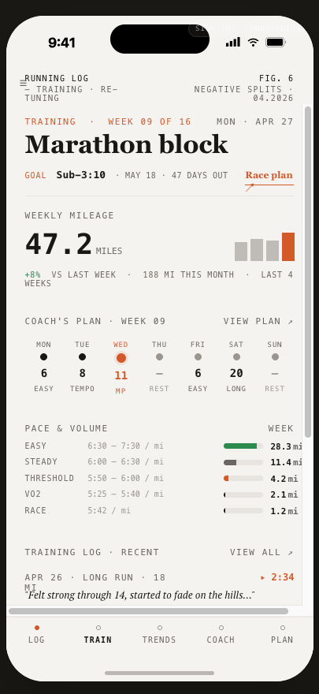
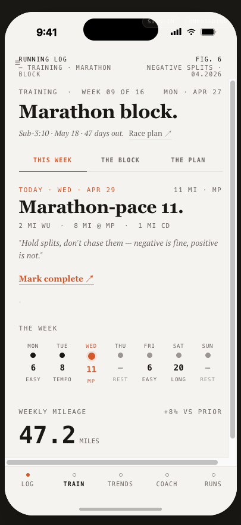
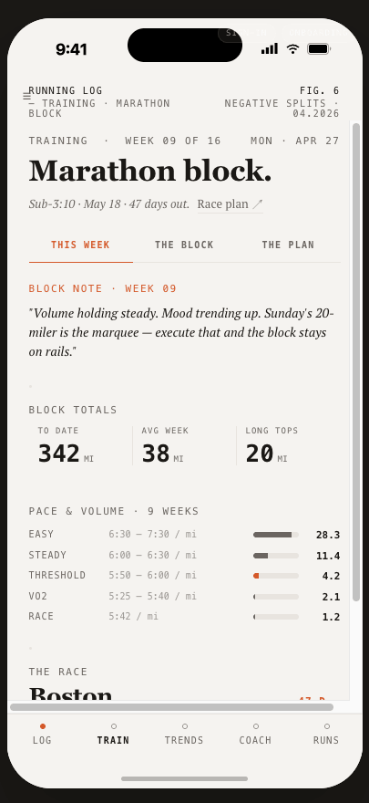
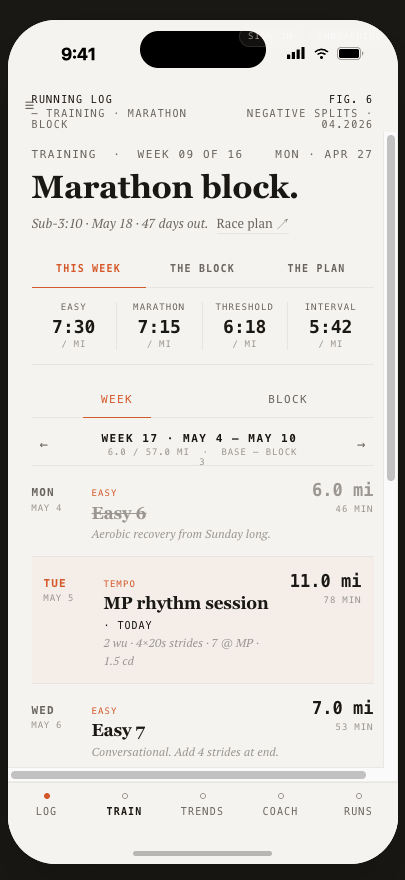

# Training tab redesign — handoff

**Status:** spec frozen, ready to implement
**UI kit reference:** [`TrainingScreen.jsx`](./TrainingScreen.jsx) + [`PlanScreen.jsx`](./PlanScreen.jsx) (sibling files) — open `ui_kits/ios_app/index.html` in the design-system project, tap Train
**Old UI kit (for diff):** [`TrainingScreen.v1.jsx`](./TrainingScreen.v1.jsx)

---

## TL;DR

The Train tab is doing too much in one scroll, and the tab bar has Plan as a top-level slot that overlaps with Train. This redesign makes two simultaneous moves:

1. **Train becomes "the current block"** — three lenses on the same arc behind a segmenter at the top of the tab.
2. **The bottom tab bar drops Plan and adds Runs**, matching the design-system README's canonical bar: **LOG · TRAIN · TRENDS · COACH · RUNS**.

| | |
|---|---|
| Before (one scroll, six sections, five corals) |  |
| After · WEEK (today, this week's plan) |  |
| After · BLOCK (the arc, totals, race) |  |
| After · PLAN (the full multi-week calendar) |  |

Net result: Train is **about** something now ("the block"), each lens has a clear job, and the tab bar matches the design-system README.

---

## The three lenses

The Train tab is the home for everything block-related. Three views behind one segmenter:

| Lens | Timescale | Question it answers | Source of new component |
|---|---|---|---|
| **THIS WEEK** | 7 days | What am I doing today and this week? | new |
| **THE BLOCK** | 12–16 weeks | How is the arc going? | new |
| **THE PLAN** | full calendar | What's coming and when? | lifted from existing `PlanView` |

PLAN is the existing plan-as-a-tab content **rendered inline inside Train**, not a separate tab. The UI kit demonstrates this via `<PlanScreen embed onOpenDay … />`; in Swift you'd refactor `PlanView` to take a similar `embedded: Bool` param, or extract the body into a `PlanContent` sub-view both screens render.

---

## Tab bar change

The current bar in the UI kit (and the live `RunningLogApp.swift`) is **LOG · TRAIN · TRENDS · COACH · PLAN**. The design-system README declares the canonical bar is **LOG · TRAIN · TRENDS · COACH · RUNS** — Runs is the chronological-history tab (the "diary's index"). Plan was a drift.

| Tab | Role |
|---|---|
| **Log** | Today's diary entry + check-in + tomorrow's prescription. The day. |
| **Train** | The block. WEEK · BLOCK · PLAN segmenter. |
| **Trends** | Lifetime analytics — fitness line, ACWR, zone evolution. |
| **Coach** | The conversation. |
| **Runs** | Chronological history — search, filter, scroll back through every workout. |

What goes where (cleared-up overlap):

- "Today's prescribed workout" was duplicated on Log + Train. **Train owns it** as the hero of the WEEK view. Log's cockpit-half references it but doesn't render the full session.
- "Recent runs" was duplicated on Train (Training Log · Recent) + Runs. **Runs owns it.** Train's BLOCK view closes with a quiet `RECENT RUNS · OPEN RUNS ↗` link out.
- "The plan" was a top-level tab + a section on Train. **Train owns it** as the PLAN segmenter; standalone `PlanView` retires as a tab.

`RunningLogApp.swift:108` currently wires `TrainingTabView()`. Update the tab-bar list to insert a `HistoryView` (or whichever screen currently corresponds to RunsScreen) where `PlanView` used to be, and delete the Plan tab.

---

## Two coach voices — sourced explicitly

The previous draft had one ambiguous "FROM YOUR COACH" section. There are actually **two distinct coach voices** in the product, and they live on different surfaces:

| Voice | Scope | Source | Where it surfaces |
|---|---|---|---|
| **Per-workout intent** | This one specific session | `planned_workout.coach_intent` (or coach notes on the workout row) | **Inline inside the WEEK view's today hero**, italic serif, directly under the mono prescription line. No eyebrow, no left bar — it reads as the coach's voice *about today*. |
| **Weekly narrative** | This calendar week | `weekly_coaching_reports.coaching_narrative` for the current week; falls back to the locally-assembled `narrativeString` if the row is missing | **Top of the BLOCK view**, under a `BLOCK NOTE · WEEK 09` eyebrow. Italic serif. No `CoachQuote` left bar — that primitive is reserved for direct quotes the runner is reading from the coach mid-session (e.g. on Workout Detail), not week-level commentary. |

The `CoachQuote` primitive (2pt coral left-bar) is **not used on Train**. The left-bar is reserved for direct coach speech inside a workout context — Train's coach lines are softer (italic serif, no bar) because they're contextual prose, not pull-quotes.

---

## View hierarchy

```
TrainingTabView                                       ← redesign body
└── ScrollView
    ├── PlateStrip(surface: "TRAINING · MARATHON BLOCK", fig: "FIG. 6")
    ├── TrainingHeader                                ← shared across all 3 lenses
    │   ├── eyebrow row · "TRAINING · WEEK 09 OF 16" / "MON · APR 27"
    │   ├── "Marathon block." (dripDisplay 32)
    │   └── italic-serif goal line: "Sub-3:10 · May 18 · 47 days out.  Race plan ↗"
    │
    ├── TrainSegmenter(view: $segment)                ← new (3 tabs)
    │
    └── switch segment {
        case .week:
          ├── TodayHero                               ← new
          │   ├── eyebrow row · coral "TODAY · WED · APR 29" / "11 MI · MP"
          │   ├── "Marathon-pace 11." (dripDisplay 30)
          │   ├── mono prescription · "2 MI WU · 8 MI @ MP · 1 MI CD"
          │   ├── italic-serif coach intent (inline, no eyebrow, no bar)
          │   └── "Mark complete ↗"
          ├── EditorialRule
          ├── WeekStripSection                        ← uses existing CoachPlanWeekStrip
          │   ├── eyebrow "THE WEEK"
          │   └── CoachPlanWeekStrip(workouts:)
          └── WeeklyMileageQuietRow
              ├── eyebrow "WEEKLY MILEAGE" / "+8% VS PRIOR"
              └── "47.2 MILES" (dripStat 40)

        case .block:
          ├── BlockNoteSection                        ← new
          │   ├── eyebrow coral "BLOCK NOTE · WEEK 09"
          │   └── italic-serif weekly narrative
          ├── EditorialRule
          ├── BlockTotalsStrip                        ← new (3-col borderless)
          │   ├── TO DATE   · 342 MI
          │   ├── AVG WEEK  ·  38 MI
          │   └── LONG TOPS ·  20 MI
          ├── PaceVolumeSection                       ← lifted from Dashboard
          │   └── PaceVolumeSpectrumChart(samples:anchors:)
          ├── EditorialRule
          ├── RaceCountdownSection                    ← new
          │   ├── eyebrow "THE RACE"
          │   ├── "Boston Marathon." headline + "47 D ↗" coral counter
          │   └── mono line · MAY 18 · HOPKINTON → BOYLSTON · PREDICTED 3:11:14
          └── RunsLinkRow                             ← new (quiet)
              └── "RECENT RUNS · OPEN RUNS ↗"

        case .plan:
          └── PlanContent(embedded: true)             ← extracted from PlanView
              ├── pace ladder
              ├── week / block mode toggle
              ├── week nav
              └── day rows
        }
```

---

## State machine

```swift
enum TrainingTabSegment: String, CaseIterable, Identifiable {
    case week  = "THIS WEEK"
    case block = "THE BLOCK"
    case plan  = "THE PLAN"
    var id: String { rawValue }
}

@AppStorage("training.segment") private var segment: TrainingTabSegment = .week
```

Persist via `@AppStorage` so tab-switching out and back returns to the last lens.

---

## Section-by-section spec

### Shared header
- Eyebrow row · `TRAINING · WEEK 09 OF 16` left, `MON · APR 27` right · `dripEyebrow(11)` · tracking `1.3` · `textSecondary`. Double-spaced middle-dot.
- Headline · `Text("Marathon block.")` · `dripDisplay(32)` · `textPrimary` · period mandatory.
- Goal line · PT Serif italic 13pt · `textSecondary` · format `Sub-3:10 · May 18 · 47 days out.` followed by un-italic `Race plan ↗` link with hairline bottom border.
- No coral on the header section.

### Segmenter
- Three flex tabs, equal width, `12pt` vertical padding.
- Active: `coral` text + `1.5pt` coral underline overlapping the `1pt` baseline.
- Inactive: `textSecondary` + transparent underline.
- `dripEyebrow(10)`, weight `.semibold`, tracking `1.2` (0.12em).

### WEEK · Today hero
- Eyebrow row · **coral** `TODAY · WED · APR 29` left, neutral `11 MI · MP` right.
- Headline · `Text("Marathon-pace 11.")` · `dripDisplay(30)` · period mandatory.
- Prescription · mono caps `2 MI WU · 8 MI @ MP · 1 MI CD` · `dripEyebrow(11)` · `textSecondary` · tracking `1.1`.
- **Coach intent** · italic serif 14pt · `textSecondary` · curly quotes · sourced from `planned_workout.coach_intent` for today's row. Format: a single sentence, sometimes two clauses joined by an em-dash. Examples: *"Hold splits, don't chase them — negative is fine, positive is not."* / *"Easy day. Conversational pace, nasal breathing."* / *"Strides at the end, 4 × 20s — turnover before the long day."*
- Action · `Mark complete ↗` · coral text · bottom border 1pt coral at 2pt offset · Crimson Pro semibold 14pt. Tapping opens the existing workout-completion flow.
- **No card.** Hero is flush on paper.
- **No standalone "FROM YOUR COACH" section** in WEEK — coach intent lives inside the hero.

### WEEK · Week strip
- `EditorialRule` above.
- Eyebrow `THE WEEK`.
- Body · `CoachPlanWeekStrip(workouts:)` — use as-is.

### WEEK · Weekly mileage
- Eyebrow `WEEKLY MILEAGE` left, `+8% VS PRIOR` right (color: `energized` on positive delta, `coral` on negative).
- Big number · `dripStat(40)` · `47.2` + `MILES` in `dripEyebrow(11)`.
- **No chart** in WEEK. The 8-week sparkline doesn't appear here — block-level trend lives only in BLOCK.

### BLOCK · Block note
- Eyebrow **coral** `BLOCK NOTE · WEEK 09`.
- Body · italic serif 14pt · `textPrimary` · curly quotes · sourced from `weekly_coaching_reports.coaching_narrative` for current week. Fallback: locally-assembled `narrativeString` (see `TrainingDashboardView`).
- **No left bar.** This is week-level commentary, not a per-session pull-quote.

### BLOCK · Totals strip
- Eyebrow `BLOCK TOTALS`.
- Three borderless columns separated by 1pt dividers:
  - `TO DATE` — sum of completed-block miles
  - `AVG WEEK` — `TO DATE / completedWeeks`
  - `LONG TOPS` — max single-run distance in the block
- Per column: small mono eyebrow + `dripStat(26)` value + tiny `MI` unit.

### BLOCK · Pace × volume
- Eyebrow `PACE & VOLUME · 9 WEEKS`.
- Lift `paceVolumeSpectrumSection` from `TrainingDashboardView` as-is.
- Anchored by `equivalentPaces`: EASY / STEADY / THRESHOLD / VO2 / RACE.
- Only THRESHOLD's bar is coral. Others ink-2.

### BLOCK · Race countdown
- `EditorialRule` above.
- Eyebrow `THE RACE`.
- Headline · `Text("\(plan.targetRaceName).")` · `dripDisplay(26)` · period mandatory.
- Right-aligned coral counter · `\(daysRemaining) D ↗` · mono `dripEyebrow(11)`. Tapping opens `RacePlanScreen`.
- Mono caption line · uppercase · `MAY 18 · HOPKINTON → BOYLSTON · PREDICTED 3:11:14`. Composed from race date + race location + predicted finish time.
- Whole section is tappable (acts as the entry point to the full race plan).

### BLOCK · Runs link row
- Centered single-line mono link: `RECENT RUNS · OPEN RUNS ↗` · `textSecondary` · hairline bottom border.
- Tap action: switch the bottom tab to `Runs` (in Swift: select tab index 4 / the `.runs` case).

### PLAN
- Renders `PlanContent(embedded: true)` — the extracted body of `PlanView`.
- The extraction means: drop the `PlateStrip` + the "Marathon block." hero (Train's own header covers both) and just render pace ladder + week/block toggle + day rows.
- Existing `PlanView` keeps working as a standalone screen (used from sheets / deep links) by rendering `PlanContent(embedded: false)` with the chrome included.

---

## Coral discipline

| Section | Coral element(s) |
|---|---|
| Header | none |
| Segmenter | active tab label + underline |
| WEEK · Today hero | `TODAY · WED · APR 29` eyebrow + `Mark complete ↗` link (same cluster) |
| WEEK · Week strip | today's amber/coral node + ring (`CoachPlanWeekStrip` handles) |
| WEEK · Mileage | none — except `coral` on the delta when it's negative |
| BLOCK · Note | `BLOCK NOTE · WEEK 09` eyebrow |
| BLOCK · Totals | none |
| BLOCK · Pace × Volume | THRESHOLD bar only |
| BLOCK · Race | `47 D ↗` counter |
| BLOCK · Runs link | none |
| PLAN | the current-day's row pill (existing `PlanContent` styling) |

Test: no more than 2 coral elements should be visible above the fold in any lens.

---

## Reuse / Build / Lift / Retire

### Reuse as-is
- `PlateStrip`, `EditorialRule`, `Hairline`, `CoachPlanWeekStrip`, `MoodBadge`, `TrainingLogPreviewRow`, `PaceVolumeSpectrumChart`
- All `dripDisplay/dripEyebrow/dripStat/dripBody` fonts
- All `Color.drip.*` tokens

### Build new
- `TrainingHeader` — shared block-title header
- `TrainSegmenter(segment: Binding<TrainingTabSegment>)` — pure layout, no state
- `TodayHero(workout:, onMarkComplete:)` — pulls today's `PlannedWorkout` from `trainingPlanVM.currentWeekWorkouts.first(where: \.isToday)`
- `BlockNoteSection(narrative: String)` — eyebrow + italic-serif body
- `BlockTotalsStrip(totals:)` — three-column borderless
- `WeeklyMileageQuietRow(thisWeek: Double, deltaPct: Double)` — small mileage block for WEEK view
- `RaceCountdownSection(race:, prediction:, onTap:)` — close-out section for BLOCK
- `RunsLinkRow(onTap:)` — quiet centered link to Runs tab

### Lift across (port from `TrainingDashboardView`)
- `narrativeString` + helpers (`thisWeekMiles`, `lastWeekMiles`, `moodTrend`, `upcomingLongRun`) → into `BlockNoteSection`
- `paceVolumeSpectrumSection` → into BLOCK view
- `Calendar.iso8601Monday` extension

### Extract from `PlanView`
- `PlanContent(embedded: Bool)` — the body of the current Plan tab, parameterized so it can render with or without page chrome. Mirror what `ui_kits/ios_app/PlanScreen.jsx` does with the `embed` prop.

### Retire
- `TrainingDashboardView.swift` — move to `Training/_retired/` or delete. The redesign supersedes every section.
- `TrainingTabView`'s existing body (pace zones / ACWR / 28-day heatmap / weekly bars / load split) — move to a dedicated Analysis screen, opened from Trends.
- `nsTrainingTitleBlock`, `nsThisWeekNarrative`, `nsMileageBlock`, `nsPaceCalibrationSection`, `nsMoodArcSection`, `aiInsightsSection`, `analysisLinkCard`, `racePredictionsSection`, `recentActivitySection`, `trainingLogsSection` (from `TrainingDashboardView`).
- Plan as a top-level tab — remove from `RunningLogApp.swift`'s TabView list.

---

## Tab bar wiring

In `RunningLogApp.swift` around line 108 (the `TabView` body), the tab list goes from 5 tabs (Log/Train/Trends/Coach/Plan) to 5 tabs (Log/Train/Trends/Coach/Runs):

```swift
// Before
TabView(selection: $selectedTab) {
    LogView()        .tag(0).tabItem { Label("Log",    systemImage: "…") }
    TrainingTabView().tag(1).tabItem { Label("Train",  systemImage: "…") }
    TrendsView()     .tag(2).tabItem { Label("Trends", systemImage: "…") }
    CoachTabView()   .tag(3).tabItem { Label("Coach",  systemImage: "…") }
    PlanView()       .tag(4).tabItem { Label("Plan",   systemImage: "…") }   // ← drop
}

// After
TabView(selection: $selectedTab) {
    LogView()        .tag(0).tabItem { Label("Log",    systemImage: "…") }
    TrainingTabView().tag(1).tabItem { Label("Train",  systemImage: "…") }
    TrendsView()     .tag(2).tabItem { Label("Trends", systemImage: "…") }
    CoachTabView()   .tag(3).tabItem { Label("Coach",  systemImage: "…") }
    HistoryView()    .tag(4).tabItem { Label("Runs",   systemImage: "…") }   // ← was a sheet
}
```

Existing entry points that opened `PlanView` as a sheet / NavigationLink should now:
1. Switch the selected tab to Train (`selectedTab = 1`)
2. Set the segment to PLAN (`segment = .plan`)

If those entry points need to skip the Train chrome and show only the calendar, they keep working — they push `PlanView()` directly, which renders `PlanContent(embedded: false)` with its own header + plate strip.

---

## Voice & copy

- All eyebrows ALL CAPS, middle-dot separator `·` (U+00B7), tracked `0.10–0.14em`.
- All standalone headlines end in a period.
- Goal/race line uses en-dash for ranges (`Sub-3:10`, `6:24–6:56 / mi`).
- Coach quotes use curly quotes — em-dash for sentence breaks.
- No emoji. No "AI-powered". No exclamation points.
- **Today's session title:** `<type, sentence case> <distance>.` — `Marathon-pace 11.`, `Tempo 8.`, `Long run 20.`, `Easy 6.`
- **Coach intent length:** one sentence ideally; max two clauses joined by an em-dash. Anything longer belongs on Workout Detail, not Train.
- **Block note length:** one or two sentences. Format the existing `narrativeString` follows: "Volume holding steady. Mood trending up. Sunday's 20-miler is the marquee."
- **Empty states:**
  - No active plan: WEEK shows *"No plan loaded. Set a goal to start tracking."* (italic serif). BLOCK and PLAN are hidden until a plan exists.
  - Rest day: today hero shows *"Rest day. Walk or stretch — nothing to log."* No Mark complete action.
  - No weekly narrative row yet: block note falls back to `narrativeString` and never shows the section blank.

---

## Acceptance checklist

- [ ] `xcodebuild` clean
- [ ] Tab bar reads LOG · TRAIN · TRENDS · COACH · RUNS (no Plan tab)
- [ ] Train opens on WEEK; segmenter switches to BLOCK and PLAN; choice persists via `@AppStorage`
- [ ] WEEK · today hero shows coach intent italic-serif inline directly under the prescription line (no eyebrow, no left bar)
- [ ] WEEK · `Mark complete ↗` triggers workout completion (same flow Day Detail uses)
- [ ] WEEK · week strip uses unmodified `CoachPlanWeekStrip`
- [ ] BLOCK · block note pulls from `weekly_coaching_reports.coaching_narrative`; falls back to `narrativeString` when empty
- [ ] BLOCK · totals strip shows TO DATE / AVG WEEK / LONG TOPS computed from active-plan + completed workouts
- [ ] BLOCK · pace × volume renders all 5 zones, only THRESHOLD bar in coral
- [ ] BLOCK · race countdown is tappable → `RacePlanScreen`
- [ ] BLOCK · `RECENT RUNS · OPEN RUNS ↗` switches the selected tab to Runs (does NOT open a sheet)
- [ ] PLAN · renders the existing PlanView's body without its own PlateStrip / hero
- [ ] `TrainingDashboardView` retired (no remaining references in the build)
- [ ] On a fresh install (no plan): WEEK shows the "no plan" empty state; BLOCK + PLAN tabs are disabled or hidden
- [ ] Snapshot tests for all three segmenter states
- [ ] No more than 2 coral elements visible above the fold in any lens

---

## File touch list

```
M  RunningLog/Training/TrainingTabView.swift          ← redesign body
M  RunningLog/Training/PlanView.swift                 ← extract PlanContent(embedded:)
M  RunningLog/App/RunningLogApp.swift                 ← swap Plan tab → Runs tab

A  RunningLog/Training/TrainingHeader.swift           ← new
A  RunningLog/Training/TrainSegmenter.swift           ← new
A  RunningLog/Training/TodayHero.swift                ← new
A  RunningLog/Training/BlockNoteSection.swift         ← new
A  RunningLog/Training/BlockTotalsStrip.swift         ← new
A  RunningLog/Training/WeeklyMileageQuietRow.swift    ← new
A  RunningLog/Training/RaceCountdownSection.swift     ← new
A  RunningLog/Training/RunsLinkRow.swift              ← new

D  RunningLog/Training/TrainingDashboardView.swift    ← retire (lift narrativeString first)
```
