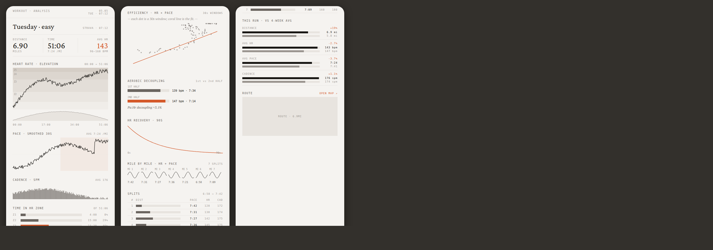
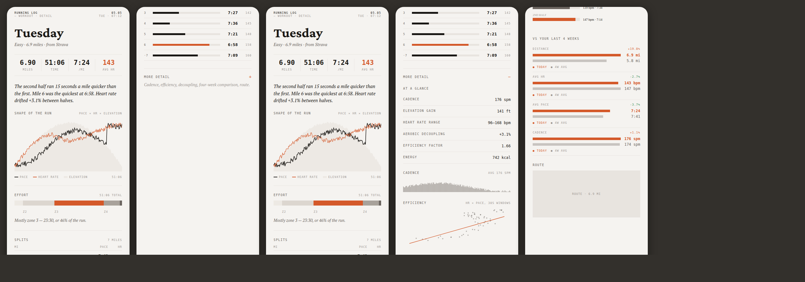

# Workout detail — simplification pass

**Date:** 2026-09-06
**Surface:** `RunningLog/Workouts/WorkoutAnalystView.swift` — the screen you
get when you open a run (from Log → entry → *view detail*, from Train, and
from Trends).
**Design system:** Post Run Drip. No new tokens, no new colours.

## The problem

The screen shipped twelve chart blocks in one flat column, every one at the
same visual weight, separated by nothing but 22pt of air. About 2,500pt of
scroll — three full phone screens — before you reached the route.

There was no answer at the top. You had to read charts to find out how your
run went, and the screen never told you in words.

Several blocks said the same thing twice: the mile-by-mile sparklines and
the splits table are the same data; heart rate, elevation and pace were three
separate charts of the same 51 minutes.

## The change

**Answer first, analysis second.**

Default view, about one and a half screens:

| Block | What it is |
|---|---|
| Heading | Day at display size; `Easy · 6.9 miles · from Strava` underneath |
| Stat strip | Four cells — distance, time, pace, avg HR. Avg HR takes the screen's coral |
| The read | One or two sentences saying what happened, in numbers |
| SHAPE OF THE RUN | Pace (ink) × heart rate (coral) × elevation (ghost fill) — one chart |
| EFFORT | One stacked zone bar plus *"Mostly zone 3 — 23:30, or 46% of the run."* |
| SPLITS | Mile · pace bar · pace · HR |

Everything else sits behind a collapsed **MORE DETAIL** disclosure: at a
glance figures, cadence, efficiency, aerobic decoupling, heart-rate recovery,
the four-week comparison, and the route.

## Consolidations

| Was | Now |
|---|---|
| `DripHRZoneChart` + `DripElevationProfile` + `DripPaceOverTimeChart` (3 blocks, 3 axis rows) | one `DripRunShapeChart` |
| `DripTimeInZoneRow` × 5 | one `DripZoneBar` + one sentence |
| `DripMileSparklines` | dropped — the splits table already said it |
| Splits table, 5 columns | 4 columns; cadence moved to *at a glance* |
| "No baseline data yet" placeholder | the section doesn't render |

No primitive was deleted. `DripHRZoneChart`, `DripElevationProfile`,
`DripPaceOverTimeChart`, `DripTimeInZoneRow` and `DripMileSparklines` are
unreferenced now but stay in `DripWorkoutPrimitives.swift`.

## The read line

`runReadLine` composes at most three clauses from data already on the
screen — split shape, fastest mile, heart-rate drift. It is **plain Swift,
not an LLM**, so it is outside the eval-harness gate (hard rule #3).

It observes and never prescribes, per `docs/coaching/principles.md`: it
will say *"Heart rate drifted +3.1% between halves"* and never *"you should
back off."* It returns `nil` when there isn't enough data to say something
true, and the block doesn't render.

## Design-system compliance

- One coral per cluster: coral is heart rate on this screen — the AVG HR
  cell and the HR line — plus the fastest split and the dominant effort
  zone, each in its own cluster.
- No em-dash placeholders (hard rule #8): every row in *at a glance* and
  every section in the drawer is gated on having real data.
- 24pt editorial margins; sections separated by `DripHairline`, not by air.

## New primitives

Added to `RunningLog/Workouts/DripWorkoutPrimitives.swift`:

- `DripRunShapeChart` — pace × HR × elevation, each normalised to its own
  range. Answers "what shape was the run", not "what were the values".
- `DripChartKey` — the mono legend under it.
- `DripKeyValueRow` — label left, number right, hairline under.
- `DripSplitRow(compact:)` — drops the distance caption and cadence column.

## Not done

- **Not verified against a compiler.** This container has no Swift
  toolchain and no Xcode. The screenshots are HTML renderings of the
  layout, built from the design-system tokens and the real font files —
  they show the composition, not a simulator capture. Build and eyeball on
  device before merging.
- The route well is still the placeholder rectangle the previous version
  had; wiring the real `MKMapView` snapshot is unchanged work.
- `workoutLabel` is still hard-coded `"easy"` — the classifier TODO
  predates this pass and now shows in the subtitle line.
